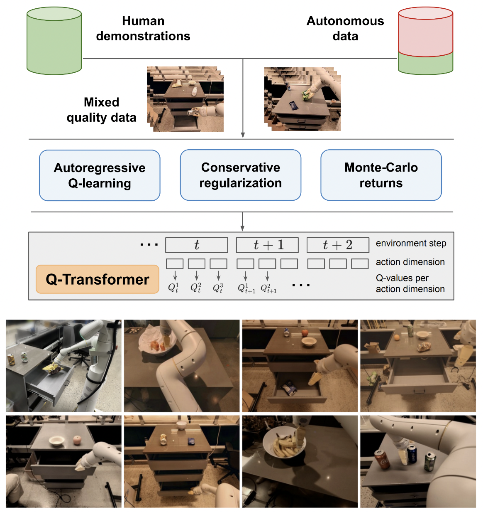

</img>

## Q-transformer

Implementation of <a href="https://qtransformer.github.io/">Q-Transformer</a>, Scalable Offline Reinforcement Learning via Autoregressive Q-Functions, out of Google Deepmind

I will be keeping around the logic for Q-learning on single action just for final comparison with the proposed autoregressive Q-learning on multiple actions. Also to serve as education for myself and the public.

The autoregressive Q-learning formulation has been reproduced by [Kotb et al.](https://arxiv.org/abs/2407.18841)

## Install

```bash
$ pip install q-transformer
```

## Usage

```python
import torch

from q_transformer import (
    QRoboticTransformer,
    QLearner,
    Agent,
    ReplayMemoryDataset
)

# the attention model

model = QRoboticTransformer(
    vit = dict(
        num_classes = 1000,
        dim_conv_stem = 64,
        dim = 64,
        dim_head = 64,
        depth = (2, 2, 5, 2),
        window_size = 7,
        mbconv_expansion_rate = 4,
        mbconv_shrinkage_rate = 0.25,
        dropout = 0.1
    ),
    num_actions = 8,
    action_bins = 256,
    depth = 1,
    heads = 8,
    dim_head = 64,
    cond_drop_prob = 0.2,
    dueling = True
)

# you need to supply your own environment, by overriding BaseEnvironment

from q_transformer.mocks import MockEnvironment

env = MockEnvironment(
    state_shape = (3, 6, 224, 224),
    text_embed_shape = (768,)
)

# env.init()     should return instructions and initial state: Tuple[str, Tensor[*state_shape]]
# env(actions)   should return rewards, next state, and done flag: Tuple[Tensor[()], Tensor[*state_shape], Tensor[()]]

# agent is a class that allows the q-model to interact with the environment to generate a replay memory dataset for learning

agent = Agent(
    model,
    environment = env,
    num_episodes = 1000,
    max_num_steps_per_episode = 100,
)

agent()

# Q learning on the replay memory dataset on the model

q_learner = QLearner(
    model,
    dataset = ReplayMemoryDataset(),
    num_train_steps = 10000,
    learning_rate = 3e-4,
    batch_size = 4,
    grad_accum_every = 16,
)

q_learner()

# after much learning
# your robot should be better at selecting optimal actions

video = torch.randn(2, 3, 6, 224, 224)

instructions = [
    'bring me that apple sitting on the table',
    'please pass the butter'
]

actions = model.get_optimal_actions(video, instructions)

```

## Appreciation

- <a href="https://stability.ai/">StabilityAI</a>, <a href="https://a16z.com/supporting-the-open-source-ai-community/">A16Z Open Source AI Grant Program</a>, and <a href="https://huggingface.co/">🤗 Huggingface</a> for the generous sponsorships, as well as my other sponsors, for affording me the independence to open source current artificial intelligence research

## Todo

- [x] first work way towards single action support
- [x] offer batchnorm-less variant of maxvit, as done in SOTA weather model metnet3
- [x] add optional deep dueling architecture
- [x] add n-step Q learning
- [x] build the conservative regularization
- [x] build out main proposal in paper (autoregressive discrete actions until last action, reward given only on last)
- [x] improvise decoder head variant, instead of concatenating previous actions at the frames + learned tokens stage. in other words, use classic encoder - decoder
    - [x] allow for cross attention to fine frame / learned tokens
- [x] redo maxvit with axial rotary embeddings + sigmoid gating for attending to nothing. enable flash attention for maxvit with this change
- [x] build out a simple dataset creator class, taking in the environment and model and returning a folder that can be accepted by a `ReplayDataset`
    - [x] finish basic environment loop
    - [x] store memories to memmapped files in designated folder
    - [x] `ReplayDataset` that takes in folder
        - [x] 1 time step option
        - [x] n-time steps
- [x] handle multiple instructions correctly
- [x] show a simple end-to-end example, in the same style as all other repos
- [x] handle no instructions, leverage null conditioner in CFG library
- [x] cache kv for action decoding
- [x] for exploration, allow for finely randomizing a subset of actions, and not all actions at once
    - [ ] also allow for gumbel based sampling of actions, with annealing of gumbel noise

- [ ] consult some RL experts and figure out if there are any new headways into resolving <a href="https://www.cs.toronto.edu/~cebly/Papers/CONQUR_ICML_2020_camera_ready.pdf">delusional bias</a>
- [ ] figure out if one can train with randomized orders of actions - order could be sent as a conditioning that is concatted or summed before attention layers
    - [ ] offer an improvised variant where the first action token suggests the action ordering. all actions aren't made equal, and some may need to attend to past actions more than others
- [ ] simple beam search function for optimal actions
- [ ] improvise cross attention to past actions and states of timestep, transformer-xl fashion (w/ structured memory dropout)
- [ ] see if the main idea in this paper is applicable to language models <a href="https://github.com/lucidrains/llama-qrlhf">here</a>

## Citations

```bibtex
@inproceedings{qtransformer,
    title   = {Q-Transformer: Scalable Offline Reinforcement Learning via Autoregressive Q-Functions},
    authors = {Yevgen Chebotar and Quan Vuong and Alex Irpan and Karol Hausman and Fei Xia and Yao Lu and Aviral Kumar and Tianhe Yu and Alexander Herzog and Karl Pertsch and Keerthana Gopalakrishnan and Julian Ibarz and Ofir Nachum and Sumedh Sontakke and Grecia Salazar and Huong T Tran and Jodilyn Peralta and Clayton Tan and Deeksha Manjunath and Jaspiar Singht and Brianna Zitkovich and Tomas Jackson and Kanishka Rao and Chelsea Finn and Sergey Levine},
    booktitle = {7th Annual Conference on Robot Learning},
    year   = {2023}
}
```

```bibtex
@inproceedings{dao2022flashattention,
    title   = {Flash{A}ttention: Fast and Memory-Efficient Exact Attention with {IO}-Awareness},
    author  = {Dao, Tri and Fu, Daniel Y. and Ermon, Stefano and Rudra, Atri and R{\'e}, Christopher},
    booktitle = {Advances in Neural Information Processing Systems},
    year    = {2022}
}
```

```bibtex
@inproceedings{Kumar2023MaintainingPI,
    title   = {Maintaining Plasticity in Continual Learning via Regenerative Regularization},
    author  = {Saurabh Kumar and Henrik Marklund and Benjamin Van Roy},
    year    = {2023},
    url     = {https://api.semanticscholar.org/CorpusID:261076021}
}
```

```bibtex
@misc{Rubin2024,
    author  = {Ohad Rubin},
    url     = {https://medium.com/@ohadrubin/exploring-weight-decay-in-layer-normalization-challenges-and-a-reparameterization-solution-ad4d12c24950}
}
```

```bibtex
@article{Farebrother2024StopRT,
    title   = {Stop Regressing: Training Value Functions via Classification for Scalable Deep RL},
    author  = {Jesse Farebrother and Jordi Orbay and Quan Ho Vuong and Adrien Ali Taiga and Yevgen Chebotar and Ted Xiao and Alex Irpan and Sergey Levine and Pablo Samuel Castro and Aleksandra Faust and Aviral Kumar and Rishabh Agarwal},
    journal = {ArXiv},
    year   = {2024},
    volume = {abs/2403.03950},
    url    = {https://api.semanticscholar.org/CorpusID:268253088}
}
```

```bibtex
@inproceedings{Hasselt2015DeepRL,
    title   = {Deep Reinforcement Learning with Double Q-Learning},
    author  = {H. V. Hasselt and Arthur Guez and David Silver},
    booktitle = {AAAI Conference on Artificial Intelligence},
    year    = {2015},
    url     = {https://api.semanticscholar.org/CorpusID:6208256}
}
```
